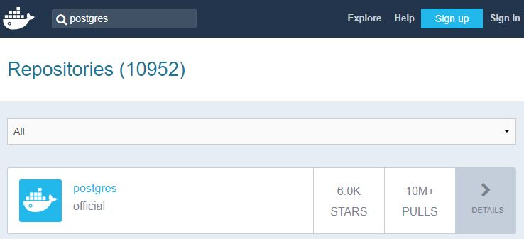
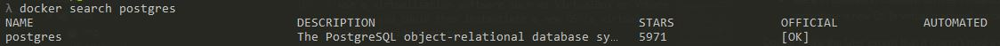
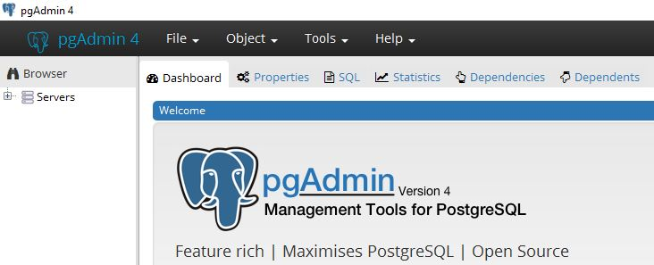

# PostgreSQL DB with Docker

Quickly set up a Postgres DB in a docker's container

## Description

This tutorial show case the way you can install a docker's container running a Postgres DB in not time.
We'll use the command line to set up such an environment and better understand how this work.

## Basics

So, what the hell is Docker anyway?

You may be more familiar with the word "virtualisation". Docker is such a tool.
When needing to play with different OS environment on one machine, you used to either:

* partition your disk to host those differrent environments (one for Windows and another for Linux for example)
* use a virtualisation software such as VirtualBox or VMWare in witch you could then instantiate a new OS (a virtual machine) inside that software

Docker is like the later except that it doesn't hold a whole operating system. Instead, it only load the core fonctionnalities of the OS needed for a specific goal (manage a postgres database for exemple).

The samples used to load the core fonctionnalities are called images. The running instance lauched from an image is called a container.

We are going to download a PostgreSQL image then run a container witch will host our database.

## Prerequisites

* Download [here](https://www.docker.com/products/docker-desktop "Install for Docker") and install the docker software related to your operating system

## Step by step

### Identify the needed image

* From [docker Hub](https://hub.docker.com/ "Docker Hub")

    

* From the CLI

    

## Downloading the image

Once the image is identified, you can then download it from the CLI with the following command

```
    docker pull postgres
```

* The following command list your local images

    ```
        docker images
    ```

## Creating the container

### Creation

The container will hold the Postgres database we want to use.
We can create and run that container with the following command :

```
    docker run -v c:\SharedFolder:/data -p 5432:5432 -e POSTGRES_PASSWORD="your_password" --name <container_name> postgres
```

The options :

* -v specify the folder you want to share with you container (here c:\SharedFolder) and the mapped folder in the container (here /data)
* -p maps the 5432 container's port to the 5432 host's port
* -e set an environment variable
* --name specify the name of your container

Others options :

* -d run in detached mode
* -it make container interactive even in detached mode and allocate a TTY
* --rm delete container as soon as it stop running

### Check existance

The following command list all existing container

```
    docker ps -a
```

The following command list all running container

```
    docker ps
```

The created container should be listed.

You can stop a running container with the command

```
    docker stop <container_name>
```

And start a not running container with the command

```
    docker start <container_name>
```

## Accessing the container

You have a running container. How do you work with it.
You can access it with the following command

```
    docker exec -it <container_name> bash
```

One you're in, you can interact with your database

## Configure PostgreSQL

In the container CLI,

```
psql -h localhost -U postgres
```

You can know execute queries for the Postgres databse of your container

```
    CREATE USER your_user WITH LOGIN NOSUPERUSER CREATEDB NOCREATEROLE NOINHERIT NOREPLICATION CONNECTION LIMIT -1 PASSWORD 'your_pwd';

    COMMENT ON ROLE your_user IS 'your description';

    CREATE DATABASE your_db;

    GRANT ALL PRIVILEGES ON DATABASE "your_db" to your_user;
```

## pgAdmin

You can interact with your newly installed PostgreSQL database with the pgAdmin tool



Download it [here](https://www.pgadmin.org/download/ "pgAdmin download")!

## Access Postgres container from another container

If you want an app running in another container, let's say for example a container running ubuntu image, you can add the option --link <postgres_container_name> when creating that container. It will be then linked to your database container.

## Reach for the sky

You can go further by mastering dockerfile and docker-compose to run your container

Hope this information help! Enjoy the ride :-)!


